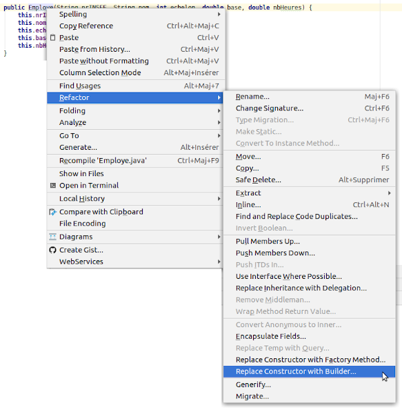
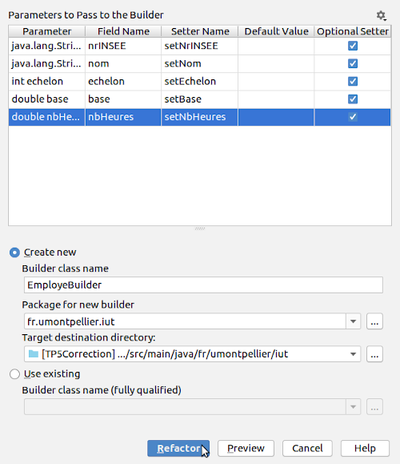

# 

# Bases de la programmation orientée objet

### IUT Montpellier-Sète – Département Informatique

* **Cours:** [M2103](http://cache.media.enseignementsup-recherche.gouv.fr/file/25/09/7/PPN_INFORMATIQUE_256097.pdf) - support [ici](https://github.com/IUTInfoMontp-M2103/Ressources)
* **Enseignants:** [Marin Bougeret](mailto:marin.bougeret@umontpellier.fr), [Romain Lebreton](mailto:romain.lebreton@umontpellier.fr), [Sophie Nabitz](mailto:sophie.nabitz@univ-avignon.fr), [Victor Poupet](mailto:victor.poupet@umontpellier.fr), [Petru Valicov](mailto:petru.valicov@umontpellier.fr)
* Le [forum Piazza](https://piazza.com/class/kjifrxy1n0i3xa) de ce cours pour poser vos questions
* [Email](mailto:petru.valicov@umontpellier.fr) pour une question d'ordre privée concernant le cours.
* Le [sujet du TP](https://pageperso.lis-lab.fr/~petru.valicov/Cours/M2103/TP5.pdf) en format .pdf téléchargeable et imprimable.

<!--Avant de démarrer le TP, vérifiez que vous n'avez pas atteint votre quota d'espace de stockage autorisé :

* placez-vous dans votre `$HOME` et utilisez les commandes suivantes :
    * `du -sh` pour voir combien d'espace vous avez déjà utilisé
    * `du -sh *` pour voir combien d'espace vous avez déjà utilisé pour chaque fichier (sans fichiers cachés)
    * `du -sch .[!.]* *` pour voir combien d'espace vous avez déjà utilisé pour chaque fichier, y compris les fichiers cachés
* Supprimez les fichiers inutiles.
* Pour éviter des problèmes durant vos TPs d'informatique, vous devriez toujours **garder 300-400 Mo d'espace libre**.
-->

### Consignes (importantes pour la notation)
- Vous respecterez toutes les [consignes](https://github.com/IUTInfoMontp-M2103/TP4#consignes) indiquées dans le TP précédent
- Vous respecterez les conventions de nommage *Java* (vues en [cours](http://pageperso.lis-lab.fr/~petru.valicov/Cours/M2103/BPOO_Generalites_x4.pdf)
ou disponibles sur le site d'Oracle). Prêtez une attention particulière au respect des noms de classes, attributs et méthodes qui vous seront demandés.
- Dans ce TP, un principe important que vous devriez essayer de respecter dans votre code est le principe [DRY](https://fr.wikipedia.org/wiki/Ne_vous_r%C3%A9p%C3%A9tez_pas).
- Pour chaque question nécessitant une vérification automatique, vous écrirez des tests unitaires, pour valider votre solution.
- **Vous nommerez les classes telles que demandé dans le sujet et respecterez les signatures des méthodes qui vous sont demandées. Sinon, votre code ne pourra pas être testé...**


## TP5
#### _Thème : Héritage - réutiliser, mais sans en abuser_

Cliquez sur le lien ci-dessous pour faire votre fork privé du TP :

https://classroom.github.com/a/Aa2TX0UU

Date limite de rendu de votre code sur le dépôt GitHub : **Dimanche 21 février à 23h00**

Vous êtes chargés de proposer une application de gestion des employés dans une entreprise.
L’objectif est de développer votre application de manière incrémentale, en ajoutant les fonctionnalités demandées au fur et à mesure __sans modifier les fonctionnalités écrites précédemment__ (à moins qu'il vous est demandé explicitement de modifier le code). Ce que l'on considère ici comme _modification_
c'est effacer et/ou réécrire du code précédemment écrit. _Ajouter_ du code sans modifier le code précédent est donc
une opération valide. On dira ici, que pour chaque modification de votre programme (effacement et réécriture) la
[dette](https://fr.wikipedia.org/wiki/Dette_technique) de votre logiciel augmente.
Afin de respecter les divers principes en programmation orientée objets (encapsulation, DRY, YAGNI etc.), vous essayerez
d'éviter au maximum de _modifier_ le programme écrit précédemment pour ne pas trop augmenter cette dette...

Dans tout ce TP, tous les attributs devraient être `private` (en particulier il est **très déconseillé** d'utiliser la visibilité `protected` pour les attributs).

### Exercice 1

1. Dans un premier temps vous devez modéliser les employés représentés par les données suivantes : numéro de
   sécurité sociale, nom, échelon (entier naturel). Pour pouvoir calculer le salaire brut et le salaire net d'un employé,
   deux attributs supplémentaires de type `double` sont nécessaires : `base` et `nbHeures`. Implémentez la classe `Employe`
   qui vous est donnée et complétez son constructeur (**avec les paramètres dans cet ordre**) :
    ```java
       public Employe(String nrINSEE, String nom, int echelon, double base, double nbHeures)
    ```
2. Le constructeur ayant beaucoup de paramètres, il vous est également
    demandé de proposer un _builder_ pour une construction plus souple (cf.
    [question 5, Exercice 3 du TP3](https://github.com/IUTInfoMontp-M2103/tp3#exercice-3-bonus)).
    Vous pouvez générer le builder de manière automatique avec l'outil de refactoring d'IntelliJ IDEA :
   * clic droit sur le nom du constructeur de votre classe &rightarrow; _Refactor_ &rightarrow;
   _Replace Constructor with Builder_ :
     
    
   * Dans la fenêtre qui s'affiche vous cocherez tous les paramètres comme indiqué dans le dessin ci-dessous et cliquerez
    sur le bouton _Refactor_ :   
   
     
   C'est possible de générer le builder dans d'autres IDE, mais c'est moins automatique.
   
   **Important :** générer le builder, ne veut pas dire changer le constructeur de la classe `Employe`... **il ne faut pas** changer la signature du constructeur de `Employe` qui vous est donnée


3. Le salaire brut de l’employé se calcule de la manière suivante : `base * nbHeures`.
 Le salaire net représentera toujours 80% du salaire brut. Ajoutez le code nécessaire (attributs et méthodes) pour intégrer ces fonctionnalités et proposez des méthodes respectives `getSalaireBrut()` et `getSalaireNet()`.
 
4. Redéfinissez la méthode `String toString()` dans la classe `Employe` pour afficher les informations concernant un employé
(y compris ses salaires brut et net).
 
5. Si votre client vous demande de changer (modifier donc) la formule de calcul du salaire brut et de la fixer à `base * nbHeures * 1.05`,
combien de changement devriez-vous effectuer pour que votre programme continue de fonctionner correctement ? Est-ce que vous pouvez faire mieux ?
   
    __Remarque__ : comme convenu précédemment, dans ce qui suit, le salaire brut d'un employé restera toujours le même, à savoir `base * nbHeures`
   
6. Vérifiez votre solution dans le programme principal (la classe `GestionEmployes`). Vous y instancierez plusieurs employés (avec le _builder_) et afficherez les informations les concernant. N'oubliez pas les tests unitaires pour les questions précédentes !


### Exercice 2

1. Avec le développement de l'entreprise, une séparation des traitements pour les différents types
d'employés devient nécessaire. Il faut spécifier les cas des _Commerciaux_, _Fabricants_, et les autres employés qu’on appellera _Techniciens_.
   * La classe `Commercial` a comme attributs `chiffreAffaires` et `tauxCommission`  (tous les deux de type `double`).
   * La classe `Fabricant` a comme attributs `nbUnitesProduites` et `tauxCommissionUnite` (type `int`et `double` respectivement).
   * La classe `Technicien` n'a pour l'instant aucun nouveau attribut, ni aucune nouvelle méthode.
   
   Implémentez les classes correspondantes en les faisant hériter de la classe `Employe`. Voici la signature des constructeurs de ces classes :
    ```java
       public Commercial(String nrINSEE, String nom, int echelon, double base, double nbHeures, double chiffreAffaires, double tauxCommission)
       public Fabricant(String nrINSEE, String nom, int echelon, double base, double nbHeures, int nbUnitesProduites, double tauxCommissionUnite)
       public Technicien(String nrINSEE, String nom, int echelon, double base, double nbHeures)
    ```
        
    Ne générez pas des _builders_ pour ces classes pour le moment.

2. Un commercial peut négocier des transactions (avec la méthode `void negocierTransaction()`), un fabricant fabrique des
produits (méthode `void fabriquerProduit()`), un technicien effectue les autres tâches dans l’entreprise
(méthode `void effectuerTacheTechnique()`). Toutes ces méthodes sont de type `void` et se contentent
d'afficher un message approprié pour illustrer leur bon fonctionnement. Par exemple, la méthode `void negocierTransaction()`
devra afficher ”_Je négocie une transaction_”.

3. Vérifiez votre programme dans la classe principale, en instanciant un objet pour chaque nouveau type d'employé et en
appelant sa fonction spécifique.

4. On souhaite varier le calcul des salaires bruts des différents types d’employés :
    * Le salaire brut d’un technicien est composé de son salaire brut en tant qu’employé + une majoration
    en fonction de son échelon. Dans notre exemple, le résultat de ce calcul devrait correspondre à 
    `base ∗ nbHeures + echelon ∗ 100`.
    * Le salaire brut d’un commercial dépend du chiffre d’affaires qu’il réalise. Ainsi, le salaire brut se calcule
    suivant la formule `base + chiffreAffaires ∗ tauxCommission`.
    * Le salaire brut d’un fabricant est calculé de la même manière que le salaire brut d’un employé en ajoutant une
    rémunération supplémentaire en fonction du rendement. Dans notre exemple, le résultat de ce calcul devrait
    correspondre à `base ∗ nbHeures + nbUnitesProduites ∗ tauxCommissionUnite`.
    * **Important :** la modalité de calcul du salaire net demeure inchangée pour tous les employés (à savoir 80% du
    salaire brut).
    
   _Redéfinissez_ la méthode `getSalaireBrut()` dans chaque classe d'employé spécifique pour prendre en compte
   ces nouvelles formules. Vous ajouterez le code qui vous paraît nécessaire à la classe `Employe` mais sans modifier
   le code précédemment écrit.

5. Déclarez un objet de type `Employe` et instanciez-le en tant que `Fabricant`. Observez le résultat de l'appel des méthodes
`getSalaireBrut()` et `getSalaireNet()`. Est-ce que la méthode `fabriquerProduit()` est accessible ?
Expliquez en comparant avec le scénario où l'objet serait déclaré en tant que `Fabricant`. 

6. Si le patron devient plus généreux et décide d’ajouter 100€ au salaire brut de tous ses employés, combien de
modifications devez-vous apporter à votre code pour que cela fonctionne ?

### Exercice 3

1. Maintenant, votre client se rend compte qu’un `Commercial` ne peut pas être un simple commercial (donc ne peut pas être
   instancié en tant que tel), mais doit être distingué en tant que `Vendeur` ou `Representant`. Un vendeur peut vendre des
   produits (méthode `void vendreProduit()`) et un représentant peut représenter l'entreprise auprès des différents clients
   (méthode `void representerEntreprise()`). Ajoutez les deux classes correspondantes en faisant un héritage de `Commercial`.

   Voici la signature des constructeurs de ces classes :
    ```java
    public Vendeur(String nrINSEE, String nom, int echelon, double base, double nbHeures, double chiffreAffaires, double tauxCommission)
    public Representant(String nrINSEE, String nom, int echelon, double base, double nbHeures, double chiffreAffaires, double tauxCommission)
    ```

   Pour rendre la classe `Commercial` non-instanciable il faut modifier sa déclaration en ajoutant le mot-clé `abstract` : `public abstract class`. Observez les changements à faire à l'utilisation des objets `Commercial`.

2. Implémentez les _builders_ pour les classes `Technicien`, `Fabricant`, `Representant` et `Vendeur`.

    **Remarque :** observez la duplication de code entre les différentes classes _builders_ (non-respect du principe [DRY](https://fr.wikipedia.org/wiki/Ne_vous_r%C3%A9p%C3%A9tez_pas)). Pour le moment, pour des raisons de facilité nous allons tolérer ce défaut et laisser les classes _builders_ telles quelles. Dans quelques semaines, après avoir suffisamment avancé dans le cours, nous y reviendront pour améliorer. Pour les curieux : https://stackoverflow.com/questions/21086417/builder-pattern-and-inheritance Une explication approfondie et une solution sont également données dans _Effective Java_ de J. Blosch, (3ème édition).

3. Pour terminer, faites en sorte que la méthode de calcul du salaire brut d'un vendeur soit _toujours_ la même que la méthode
de calcul du salaire brut d'un commercial, alors que la formule de calcul du salaire brut des représentants soit _toujours_ la même
que celle utilisée pour le salaire brut des _techniciens_. Ajoutez cette fonctionnalité dans votre application.

   **Attention** à ne pas dupliquer du code (principe [DRY](https://fr.wikipedia.org/wiki/Ne_vous_r%C3%A9p%C3%A9tez_pas))
   et à ne pas modifier le code précédemment écrit ! Sinon la [dette](https://fr.wikipedia.org/wiki/Dette_technique)
   de votre logiciel va augmenter. :smirk:

4. Quels sont les avantages et inconvénients de votre approche ?

5. **Bonus :** dessinez le diagramme de classes afin de mieux comprendre votre solution. Vous déposerez le diagramme sous forme d'image (.png ou .jpg) à la racine de votre dépôt Git.

    **Note** : les _builders_ ne doivent pas faire partie de votre diagramme de classes
